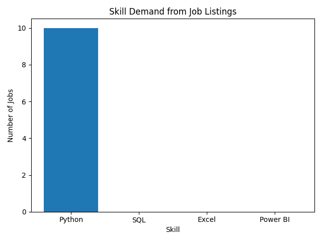

# Job Listings Scraper & Analysis

## Project Description
This project collects job listing data from online job portals and performs data analysis to identify job market trends, including role demand, location demand, and required skills.

## Project Demo Gif

<h2 align="center">🎥 Project Demo</h2>

  

## Tools & Technologies
- Python
- BeautifulSoup
- Requests
- Pandas
- Matplotlib

## Project Structure
- scraper/ - Scrapes job listings
- data/ - Stores raw and cleaned CSV files
- analysis/ - Data analysis and visualization
- README.md - Project documentation

## Analysis Performed
- Job role distribution analysis
- Location-wise job demand analysis
- Skill demand analysis
- Data cleaning and preprocessing

## Output
- Cleaned CSV datasets
- Bar charts showing job roles, locations, and skill trends
- Insights into in-demand job roles, locations, and skills

## Visualizations
### Job Locations Distribution

### Job Roles Distribution

### Skills Distribution

## How to Run
1. Install required libraries
pip install requests beautifulsoup4 pandas matplotlib

2. Run the scraper
python scraper/job_scraper.py

3. Run the analysis
python analysis/analysis.py

## Project demo
Demo video: https://drive.google.com/file/d/1MxzVNgfXRypOsWwsXb5diLdO887DRtLD/view?usp=sharing

## Conclusion
This project provides insights into current job market requirements and supports data-driven career planning.

## Author
Bhargavi Chinnaparapu
