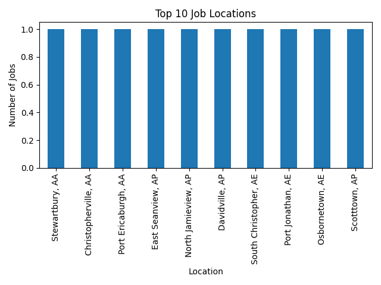
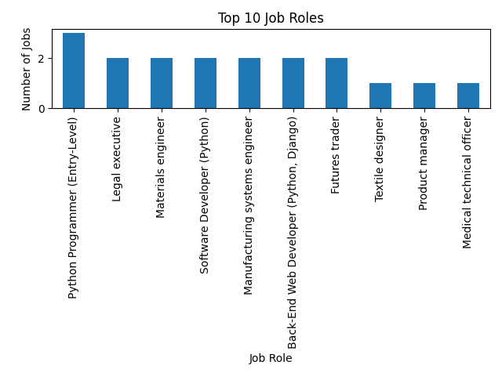

# Job Listings Scraper & Analysis

## 📌 Project Description
This project collects job listing data from online job portals and performs data analysis to understand job market trends such as role demand, location demand, and required skills.

## 🛠 Tools & Technologies
- Python
- BeautifulSoup
- Requests
- Pandas
- Matplotlib

## 📂 Project Structure
- scraper/ → Scrapes job listings
- data/ → Stores raw and cleaned CSV files
- analysis/ → Data analysis and visualization
- README.md → Project documentation

## 📊 Analysis Performed
- Job role distribution
- Location-wise job demand
- Skill demand analysis
- Data cleaning and preprocessing

## 📈 Output
- Cleaned CSV datasets
- Bar charts showing job and skill trends
- Insights into in-demand job roles and skills

## 📊 Visualizations

### Job Locations Distribution

### Job Roles Distribution

## ✅ Conclusion
This project helps understand current job market requirements and supports data-driven career planning.

## 👩‍💻 Author
Bhargavi Chinnaparapu
